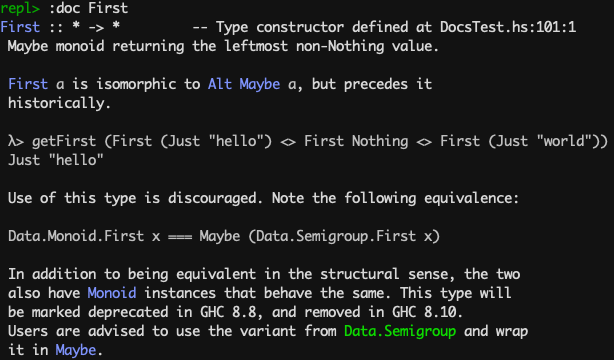
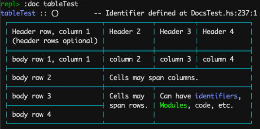

# Haddock Pretty-printer for GHCi

This is intended to provide the functionality for the GHCi `:doc` command to
render Haddocks. My hope is that it will one day [make it into
GHC](https://gitlab.haskell.org/ghc/ghc/-/issues/19254).

Examples:

